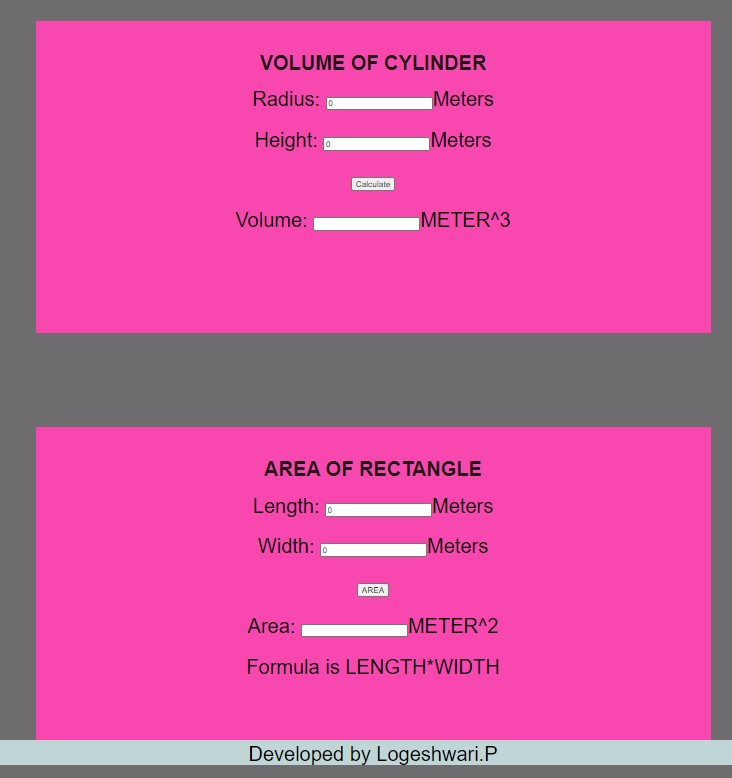

# Web Page for Mathematical Calculations

## AIM:

To design a static website with validation to perform mathematical calculations in client side.

## DESIGN STEPS:

### Step 1:

Requirement collection.

### Step 2:

Creating the layout using HTML and CSS.

### Step 3:

Write javascript to perform the calculations.

### Step 4:

Include regularexpression based input validation.

### Step 5:

Validate the layout in various browsers.

### Step 6:

Validate the HTML code.

### Step 6:

Publish the website in the given URL.

## PROGRAM :

```
<!DOCTYPE html>
<html lang="en">
<head>
    <meta charset="UTF-8">
    <meta http-equiv="X-UA-Compatible" content="IE=edge">
    <meta name="viewport" content="width=device-width, initial-scale=1.0">
    <title>addition</title>
    <style>
        * {
  box-sizing: border-box;
  font-family: Arial, Helvetica, sans-serif;
}
body {
  background-color:rgb(221, 103, 24);
}
.container {
  width: 1080px;
  margin-left: auto;
  margin-right: auto;
}
.content {
  display: block;
  width: 100%;
  background-color: #f3f3f3;
  min-height: 500px;
  margin-top: 150px;
}
h1{
    text-align: center;
    padding-top: 50px;
    color: rgb(36, 23, 23);
}
.formelement{
    text-align: center;
    font-size:xx-large;
    margin-top: 5px;
    margin-bottom: 5px;

}
.footer {
  display: block;
  width: 100%;
  height: 40px;
  background-color: #c0d5d6;
  text-align: center;
  padding-top: 10px;
  margin: 0px 0px 0px 0px;
  color: #000000;
}

    </style>
</head>
<body>
    <div class="container">
        <div class="content">
            <h1>VOLUME OF CYLINDER</h1>
            <form>
                <div class=formelement>
                    <lable for="aedit">Radius:</lable>
                    <input type="text" id="aedit" value="0"/>Meters
                </div><br>
                <div class=formelement>
                    <lable for="bedit">Height:</lable>
                    <input type="text" id="bedit" value="0"/>Meters
                </div><br>
                <div class=formelement>
                    <input type="button" value="Calculate" id="addbutton"/>
                </div><br>
                <div class=formelement>
                    <lable for="cedit">Volume:</lable>
                    <input type="text" id="cedit" readonly="0"/>METER^3
                </div>
            </form>
        </div>
    </div>
<script type="text/javascript">
    var button;
     
    button=document.querySelector("#addbutton");
    button.addEventListener("click",function(){
        
        var atext,btext,ctext;
        var aval,bval,cval
        atext=document.querySelector("#aedit");
        btext=document.querySelector("#bedit");
        ctext=document.querySelector("#cedit");

        aval=parseInt(atext.value);
        bval=parseInt(btext.value);
        cval=aval*aval*bval*3.14;
        ctext.value=""+cval;

    });

</script>    
</body>
</html>

<!DOCTYPE html>
<html lang="en">
<head>
    <meta charset="UTF-8">
    <meta http-equiv="X-UA-Compatible" content="IE=edge">
    <meta name="viewport" content="width=device-width, initial-scale=1.0">
    <title>Volume</title>
    <style>
        * {
  box-sizing: border-box;
  font-family: Arial, Helvetica, sans-serif;
}
body {
  background-color:rgb(110, 108, 110);
}
.container {
  width: 1080px;
  margin-left: auto;
  margin-right: auto;
}
.content {
  display: block;
  width: 100%;
  background-color: #f848af;
  min-height: 500px;
  margin-top: 150px;
}
.content2{
    display: block;
    width: 100%;
    background-color: #94b33e;
    min-height: 500px;
    margin-top: 150px;
    margin-bottom: 150px;
}
h1{
    text-align: center;
    padding-top: 50px;
    color: rgb(36, 23, 23);
}
.formelement{
    text-align: center;
    font-size:xx-large;
    margin-top: 5px;
    margin-bottom: 5px;

}
.footer {
  display: block;
  font-size: xx-large;
  width: 100%;
  height: 40px;
  background-color: #c0d5d6;
  text-align: center;
  padding-top: 5px;
  margin: 0px 0px 0px 0px;
  color: #000000;
}

    </style>
</head>
<body>
    <div class="container">
        <div class="content">
            <h1>AREA OF RECTANGLE</h1>
            <form>
                <div class=formelement>
                    <lable for="aedit">Length:</lable>
                    <input type="text" id="aedit" value="0"/>Meters
                </div><br>
                <div class=formelement>
                    <lable for="bedit">Width:</lable>
                    <input type="text" id="bedit" value="0"/>Meters
                </div><br>
                <div class=formelement>
                    <input type="button" value="AREA" id="calbutton"/>
                </div><br>
                <div class=formelement>
                    <lable for="cedit">Area:</lable>
                    <input type="text" id="cedit" readonly="0"/>METER^2
                </div><br>
                <div class=formelement>
                    Formula is LENGTH*WIDTH
                </div>
            </form>
        </div>
        <script type="text/javascript">
            var button;
            button=document.querySelector("#calbutton");
            button.addEventListener("click",function(){
                var atext,btext,ctext;
                var aval,bval,cval;
                atext=document.querySelector("#aedit");
                btext=document.querySelector("#bedit");
                ctext=document.querySelector("#cedit");

                aval=parseInt(atext.value);
                bval=parseInt(btext.value);
                cval=aval*bval
                ctext.value=""+cval;
            });
        </script>
            </form>
                </div>
        </div>
        <script type="text/javascript">
          var button;
          button=document.querySelector("#valbutton");
          button.addEventListener("click",function(){
            
              var lengthtext,heighttext,widthtext,volumetext;
              var lval,hval,wval,vval;
    
              lengthtext=document.querySelector("#lengthedit");
              heighttext=document.querySelector("#heightedit");
              widthtext=document.querySelector("#widthedit");
              volumetext=document.querySelector("#volumeedit");
      
              lval=parseFloat(lengthtext.value)
              hval=parseFloat(heighttext.value)
              wval=parseFloat(widthtext.value)
              vval=lval*hval*wval

              volumetext.value=""+vval;
        
      
            });
      
        </script>
        <div class="footer">
           Developed by Logeshwari.P
        </div>     

    
</body>
</html>
```

## OUTPUT:


## Result:

Thus a website is designed to perform mathematical calculations in the client side.
